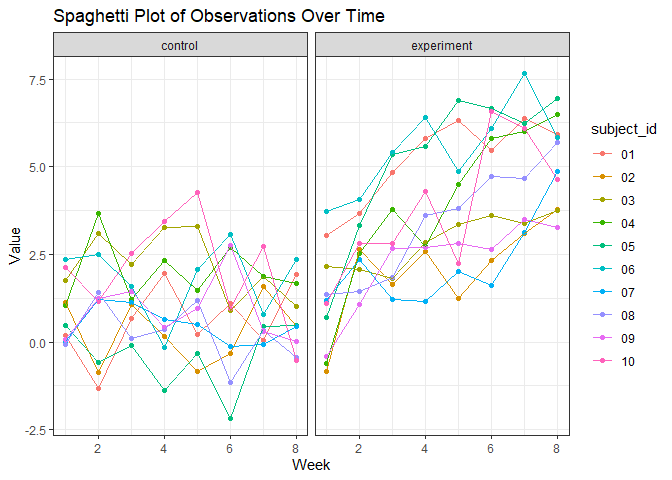

p8105_hw5_bp2678
================
Brady Pham
2023-11-13

``` r
library(tidyverse)
```

    ## ── Attaching core tidyverse packages ──────────────────────── tidyverse 2.0.0 ──
    ## ✔ dplyr     1.1.3     ✔ readr     2.1.4
    ## ✔ forcats   1.0.0     ✔ stringr   1.5.0
    ## ✔ ggplot2   3.4.3     ✔ tibble    3.2.1
    ## ✔ lubridate 1.9.2     ✔ tidyr     1.3.0
    ## ✔ purrr     1.0.2     
    ## ── Conflicts ────────────────────────────────────────── tidyverse_conflicts() ──
    ## ✖ dplyr::filter() masks stats::filter()
    ## ✖ dplyr::lag()    masks stats::lag()
    ## ℹ Use the conflicted package (<http://conflicted.r-lib.org/>) to force all conflicts to become errors

``` r
library(dplyr)
library(ggplot2)
library(rvest)
```

    ## 
    ## Attaching package: 'rvest'
    ## 
    ## The following object is masked from 'package:readr':
    ## 
    ##     guess_encoding

``` r
library(broom)
library(purrr)
set.seed(1)
```

\#Question 2

\#Loaded the files and data frame in

``` r
files_df <- 
  tibble(
    files = list.files('data'),
    path = str_c("data/", files, sep = "/")
  ) |>
  mutate(data = map(path, read_csv)) |>
  unnest(cols = c(data))
```

\#Tidy up the data

``` r
tidy_files_df <- files_df %>%
  mutate(files = str_replace(files, ".csv", ""),
         files = str_replace(files, "con", "control"),
         files = str_replace(files, "exp", "experiment")) %>%
  rename(arm_subject_id = files) %>%
  separate(arm_subject_id, into = c("arm", "subject_id"), sep = "_") %>%
  pivot_longer(cols = starts_with("week"),
               names_to = "week",
               values_to = "value") %>%
  select(-path) %>%
  mutate(week = as.numeric(gsub("week_", "", week)))
```

``` r
ggplot(tidy_files_df, aes(x = week, y = value, color = subject_id)) +
  geom_point() +
  geom_line() +
  labs(title = "Difference Between Control and Experiment Group Over 8 Weeks",
       x = "Week",
       y = "Value") +
  theme_bw() +
  facet_grid(. ~ arm)
```

<!-- -->

In the experiment group it shows that there is a general trend of the
value increasing as the weeks go by. However, in the control group it
seems to remain the same as the weeks go by and that there isn’t much
change.

\#Question 3

``` r
compare_mu_values_map <- function(mu_values = c(0, 1, 2, 3, 4, 5, 6), n = 30, sigma = 5, num_datasets = 5000, alpha = 0.05) {

  datasets <- replicate(num_datasets, rnorm(n, mean = 0, sd = sigma), simplify = FALSE)


  results <- map_df(mu_values, function(mu) {
    map_df(datasets, function(dataset) {
      t_test_result <- t.test(dataset, mu = mu)
      tidy_results <- tidy(t_test_result)
      data.frame(mu = mu, estimated_mean = tidy_results$estimate, p_value = tidy_results$p.value)
    })
  })

  return(results)
}

result_df <- compare_mu_values_map()
```
